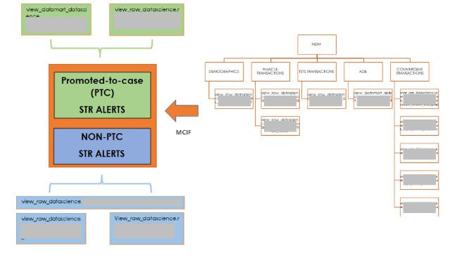

# XRAI Methodology - Model & Output (M&O) - Robustness
{: .no_toc }

## Table of contents
{: .no_toc .text-delta }

1. TOC
{:toc}

Robustness is the ability of a model to maintain its performance and make reliable predictions even when faced with variations, perturbations, or unexpected changes in the input data, model parameters, or environmental conditions. A robust machine learning model is one that is less sensitive to factors that could potentially disrupt its performance. 

## Quantitative Techniques
Achieving robustness in machine learning can involve various strategies and techniques, including: 
- <u>Attacks</u> 
    - **Evasion** – Also known as adversarial attacks, evasions try to manipulate input data that causes models to make incorrect predictions. These involve introducing small but carefully crafted perturbations to input samples, such that they are imperceptible to humans. 
    - **Poisoning** – This is when attackers insert malicious data points into the training set to influence the model’s behavior, leading it to make incorrect predictions or exhibit biased behavior. 
    - **Extraction** – These are attempts by adversaries to extract sensitive information from the model, such as its parameters or the training data used. This is usually done by reverse-engineering its models or training data. 
    - **Inference** – These attacks aim on understanding the model’s behavior and decision-making processes, such as gaining insights on how the model responds to certain inputs. These attacks are concerned with analyzing the model’s predictions and decision boundaries. 
- <u>Defenses</u> 
    - **Preprocessing** – Some techniques include removing any potentially sensitive information or PIIs, introducing random noise to training data, normalizing and scaling features, anomaly detection to filter out potentially malicious points, and applying privacy-preserving techniques such as federated learning. 
    - **Model Training** – Some techniques include training the model on a mixture of clean and intentionally adversarial examples, applying gradient regularization or using more robust loss functions (e.g. Huber loss and Wasserstein loss), utilizing probabilistic labels instead of hard labels (e.g. 0 or 1), and having weight regularization techniques. 
    - **Postprocessing** – Data scientists can try filtering out potentially sensitive or malicious outputs, adding confidence thresholds for model predictions, combining predictions from an ensemble of models, and re-ranking predictions based on additional criteria (e.g. image quality, content analysis). 

## Data Flow Diagrams (DFDs)
Data Flow Diagrams (DFDs) enable us to showcase to users and stakeholders the customized tools and processes we use to achieve maximum value from the data, and how we reach our final decision-making.  

DFDs are graphical representation of data flows through the AI system. This will include data stores and any data movement through subprocesses.  

Scikit-learn offers a display of the multiple processes / functions used during model development. The visual display of each step taken to prepare the data, tune the model and transform the predictions, will enable developers and users to evaluate specific data transformations and model configurations. This will further ensure consistency and reproducibility when data or model is being updated.   

## Qualitative Inspection 
Process checks include verifying documentary evidence of having a strategy for the selection of fairness metrics that are aligned with desired outcomes, and the definition of sensitive attributes are consistent with legislation and corporate values. Establish qualitative guidance on how models should be classified. For example, adopting a framework to classify models ‘can result in systematic disadvantage to individuals or groups’ to have ‘high impact’, while models with outputs that are ‘benign and customers can opt in/out’ to be of ‘low impact’. 

Other relevant details during the modeling process should, if necessary, be disclosed to ensure transparency to users and other stakeholders. Examples of relevant details can be:  
- **Coverage period**, which refers to the period when the model is trained and tested. This helps ensure that the coverage period represents the data the model was trained on and that it is reliable and accurate.  
- The **portfolios or products** that the model is intended for use should be reported. This includes specifying the type of data that the model was trained on (such as numerical data, text, or images, etc). The data's context or domain should be considered to ensure the model is appropriate for the specific application.  
- **Exceptions** are cases where the model would perform differently from the norm. This can include edge cases or unexpected events. This is important to inform and explain to users how the model will handle these exceptions. 

## Examine model output for unintended bias and uncertainties 
After training the ML model, we gain the predicted probabilities from the model and the predicted labels. An additional set of bias metrics can be calculated and analyzed for bias. This is to inspect any disparities in outcomes despite checks for class imbalance before training. Some examples include: 
- Difference in positive proportions in predicted labels (DPPL) 
- Disparate (Adverse) Impact (DI) 
- Difference in conditional outcome (DCO) 
- Recall Difference (RD) 
- Difference in label rates (DLR) - note difference in acceptance rates (DAR) or difference in rejection rates (DRR) and Precision Difference (PD), Accuracy Difference (AD) 
- Treatment Equality (TE) 
- Conditional Demographic Disparity in Predicted Labels (CDDPL) 
- Counterfactual Fliptest (FT) 

**AI predictions always contain a level of uncertainty**, due to imperfect and noisy data, and the presence of incomplete distribution of possible data points. For example, predicting traffic congestion at 5:00AM, would carry a high level of uncertainty, since the training/test data is collected from 6:00AM to midnight. ML models need to present uncertainties to end-users for better explainability, provide indicators during decision making, and identify limitations of the AI-enabled system. Providing an estimate of uncertainties when using AI models is already mandatory in some domains (like medicine) as proposed by the European Commission​ [(European Commission, 2021)](https://eur-lex.europa.eu/legal-content/EN/TXT/?uri=celex%3A52021PC0206).​ In any case, quantifying and reporting uncertainties will build trust with the use of AI models. Quantification methods to determine uncertainties can be based on resampling methods, such as the distribution of the leave-one-out residuals estimated by perturbed models. Other methods include the Jackknife+ method, which presents a confidence interval that a new observation would lie within a prediction interval [​(Barber et al., 2019)​](https://arxiv.org/pdf/1905.02928.pdf).  

## Performance vs perceived goodness of explanation 
There might be trade-offs between quantitative estimates of a system’s performance and XRAI objectives. For example, ML models with high performance are often based on complex algorithms with low explainability, and vice versa. While XRAI objectives can fill the gap between complexity and interpretability, a lot is still dependent on how the end-user will integrate the given information with the decision-making. The choice of models being utilized and deployed will depend on the specific context and goals of the project in each DS team. Nevertheless, we encourage DS teams to intentionally design ML systems that maximize both model performance and explainability [(Rodolfa et al., 2021)](https://www.nature.com/articles/s42256-021-00396-x). 

To evaluate how end-users evaluate and perceive explainability, satisfaction of explainability can be performed by receiving feedback from developers, users, stakeholders, etc, with the use of Explanation Goodness Checklist, Explanation Satisfaction Scale, Trust Scales [​(Hoffman et al., 2018)​](https://arxiv.org/ftp/arxiv/papers/1812/1812.04608.pdf). To determine possible trade-offs between performance and interpretability, we can provide estimates such as percentage likelihood in probability of harm, which will help to align understanding across different stakeholders who perform and validate those assessments. 