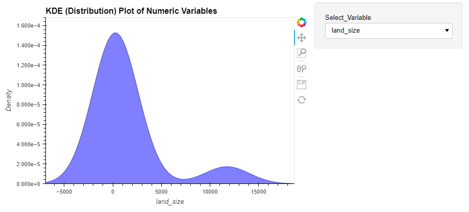
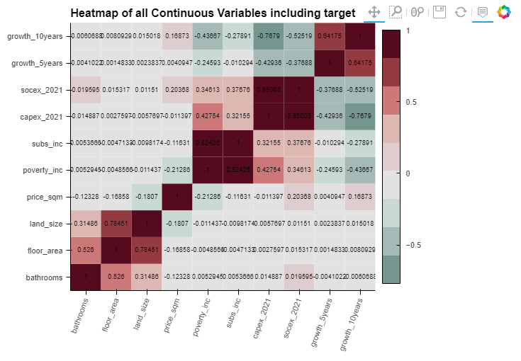
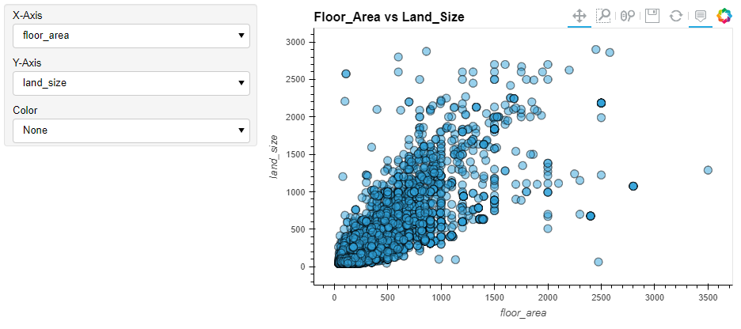
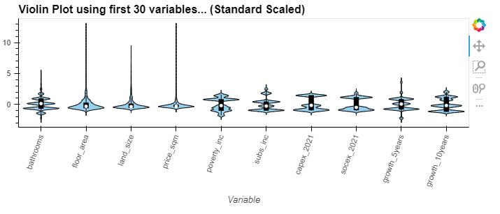
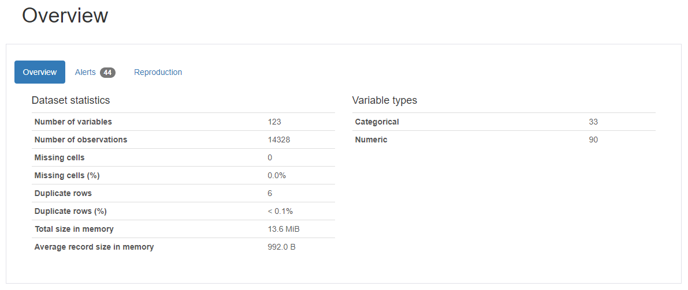
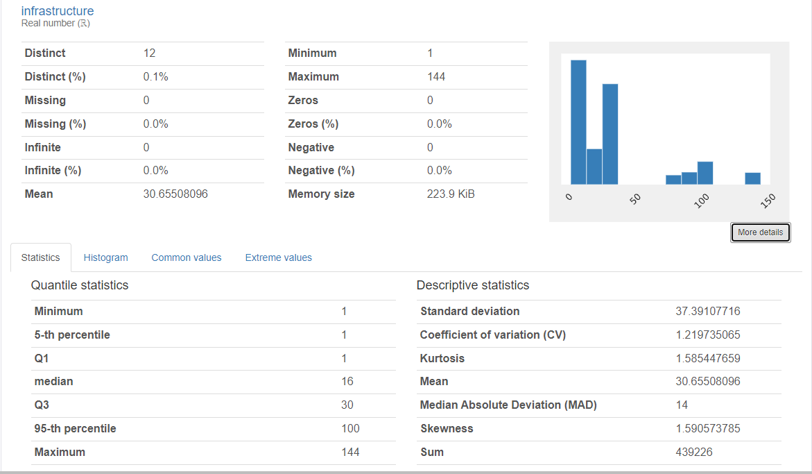

# EDA
{: .no_toc }

## Table of contents
{: .no_toc .text-delta }

1. TOC
{:toc}

## Data Preparations

Import the EDA functions from `XRAIDashboard.eda` and the other necessary functions.


```python
# Standard library
import pandas as pd

# EDA functions
from XRAIDashboard.eda.auto_eda import autoviz_eda2
```


Combine everything you want to analyze in a single dataframe using the concatenation method from `pandas` library.


```python
dataset = pd.concat([train_data, test_data], axis=0)
```

## AutoViz

Once the dataset is prepared, just feed it into the `autoviz_eda2` function. Note that this process will take long for large datasets.


```python
autoviz_eda2(dataset)
```


This command will generate 5 HTML reports that will show different visualizations.

### Categorical Variable Plot


### Distribution Plot (Numerical)



### Correlation Heatmap (Continuous)



### Scatter Plot



### Violin Plot



## Y-Data Profiling

Similar to AutoViz, you just also need to feed the concatenated dataframe to the `ydata_profiling` function. Note also that large datasets would also mean longer processing time, and larger size for the HTML report, which may crash the cloud computing platform if you're using one.


```python
from XRAIDashboard.eda.auto_eda import ydata_profiling_eda2

ydata_profiling_eda2(dataset)
```


This will output a comprehensive HTML report on the data as showcased below.








