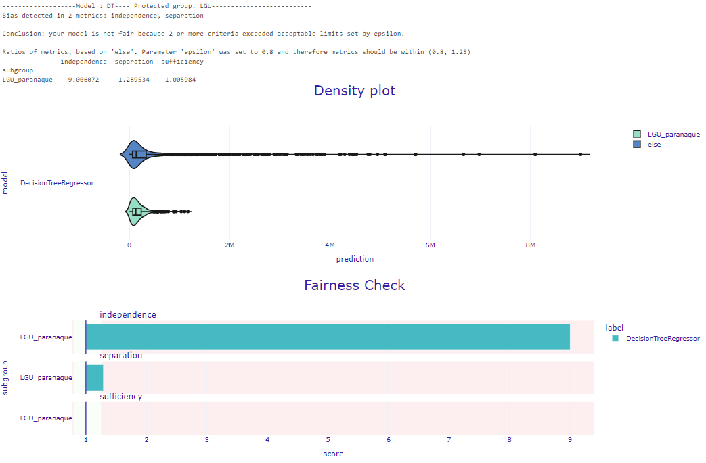
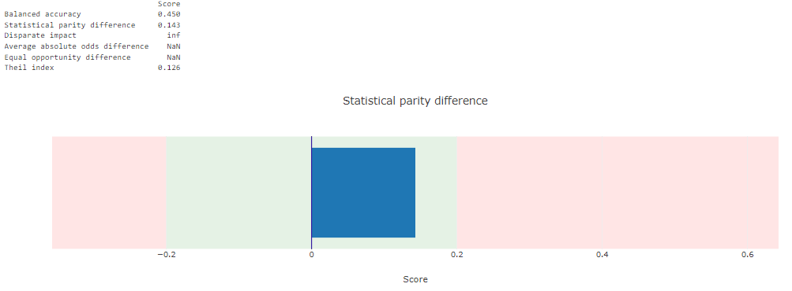
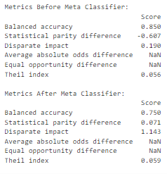
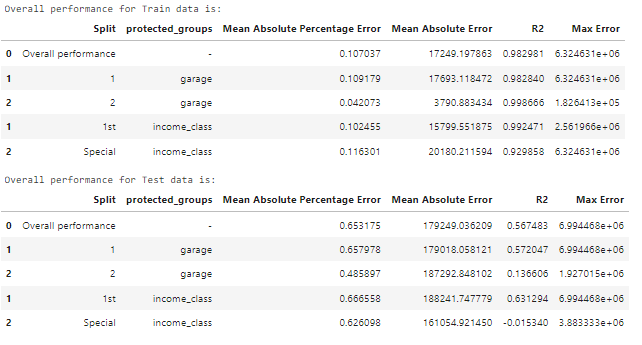

# Fairness & Performance
{: .no_toc }

## Table of contents
{: .no_toc .text-delta }

1. TOC
{:toc}

## Overview

### Classification
Some terms and metrics we will be using:
- **Statistical parity difference:** Statistical parity difference measures the difference that the majority and protected classes receive a favorable outcome. This measure must be equal to 0  to be fair.
- **Equal opportunity difference:** This measures the deviation from the equality of opportunity, which means that the same proportion of each population receives the favorable outcome. This  measure must be equal to 0 to be fair.
- **Average absolute odds difference:** This measures bias by using the false positive rate and true positive rate. This measure must be equal to 0 to be fair.
- **Disparity impact:** This compares the proportion of individuals that receive a favorable outcome for two groups, a majority group and a minority group. This measure must be equal to 1 to be fair.
- **Theil Index:** This ranges between zero and ∞, with zero representing an equal distribution and higher values representing a higher level of inequality.
- **Smoothed Emperical Differential Fairness:** This calculates the differential in the probability of favorable and unfavorable outcomes between intersecting groups divided by features. All intersecting groups are equal, so there are no unprivileged or privileged groups. The calculation produces a value between 0 and 1 that is the minimum ratio of Dirichlet  smoothed probability for favorable and unfavorable outcomes between intersecting groups in the dataset.
- **Class Imbalance:** Bias occurs when a facet value has fewer training samples when compared with another facet in the dataset. CI values near either of the extremes values of -1 or 1 are very imbalanced and are at a substantial risk of making biased predictions.
- **Threshold:** Threshold defines how far from the ideal value of the metric will be acceptable. The question is what threshold should we use? There is actually no good answer to that. It will depend on your industry and application. If your model has significant consequences, like for mortgage applications, you will need a stricter threshold. The threshold may even be defined by law. Either way, it is important to define the thresholds before you measure fairness. 0.2 seems to be a good default value for that. 

### Regression
Given $R$ as the model's prediction, $Y$ as the model's target, and $A$ to be the protected group, we have three criteria:
- **Independence:** $R$ ⊥ $A$
- **Separation:** $R$ ⊥ $A$ ∣ $Y$
- **Sufficiency:** $Y$ ⊥ $A$ ∣ $R$ 


In the approach described in Steinberg, D., et al. (2020), the authors propose a way of checking this independence. ***More info about metrics of regression***: https://arxiv.org/pdf/2001.06089.pdf

## Fairness Metric

Import the fairness functions from `XRAIDashboard.fairness.fairness` and the other necessary functions.


```python
import pandas as pd

from XRAIDashboard.fairness.fairness import gini_coefficient, model_performance, fairness
```


If you want to include variables outside of the model to be included in the analysis, define a separate dataframe for them.


```python
xextra = X_test[['ac_unit','balcony']]
xextra.columns = ["ac_unit_2","balcony_2"]
```


Execute the `fairness` function with the data, model, and a defined protected group. The protected group should be in a dictionary form, where the key-value pair is the column name and the protected value respectively.


```python
if reg:
    fairness(model, X_test, y_test, {"LGU":"paranaque"}, metric="DI", threshold=0.8,reg = True,xextra = False,dashboard = False)
elif not reg:
    fairness(model, X_test, y_test, {'purpose': 'small_business'}, metric = 'EOP', reg = False)
```





To include the `xextra` dataframe defined earlier, just input it in the xextra parameter.

## AI Fairness 360 Metrics and Bias Mitigations (Classification)

Utilizing an AI Fairness 360, an open source tool by IBM, we can detect and mitigate bias in binary classification models. 


```python
import pandas as pd
from copy import deepcopy
from aif360.datasets import StandardDataset

from XRAIDashboard.fairness.fairness_algorithm import compute_metrics, metrics_plot, disparate_impact_remover, reweighing, exponentiated_gradient_reduction, meta_classifier, calibrated_eqodds, reject_option, compare_algorithms, algo_exp
```


Prepare the preprocessed training and testing data, a copy of the model, and the protected group and value.


```python
if not reg:
    # Some required inputs and processing
    pipe = model['DT'][:-1]
    try:
        features = preprocessor.get_feature_names_out()
        print('Preprocessing - Normal')
    except:
        try:
            p_ind = preprocessor[-1].get_support(indices = True)
            fn = preprocessor[0].get_feature_names_out()
            features = [fn[x] for x in p_ind]
            print('Preprocessing - Steps')
        except:
            try:
                features = get_feature_names(preprocessor, cat_cols)
                print('Preprocessing (old) - Normal')
            except:
                p_ind = preprocessor[-1].get_support(indices = True)
                fn = get_feature_names(preprocessor[0], cat_cols)
                features = [fn[x] for x in p_ind]
                print('Preprocessing (old) - Steps')
    pipe.fit(X_train)
    X_train_proc = pd.DataFrame(pipe.transform(X_train), columns=features)
    X_test_proc = pd.DataFrame(pipe.transform(X_test), columns=features)
    train_data_proc = pd.concat([X_train_proc, y_train], axis=1)
    test_data_proc = pd.concat([X_test_proc, y_test], axis=1)

    train_data_proc.info()
```


```python
if not reg:
    # Setting up the dataset into an AIF360 Dataset class, and also the protected group and value
    protected_grp = 'cat__term_ 60 months' # You can select any categorical column
    protected_val = [1] # 0 or 1
    train_data_copy = train_data_proc.copy()
    test_data_copy = test_data_proc.copy()
    try:
        sd_train = StandardDataset(train_data_copy,target[0],[1.0],[protected_grp],[protected_val])
        sd_test = StandardDataset(test_data_copy,target[0],[1.0],[protected_grp],[protected_val])
    except:
        protected_grp = 'ohe__term_ 60 months'
        sd_train = StandardDataset(train_data_copy,target[0],[1.0],[protected_grp],[protected_val])
        sd_test = StandardDataset(test_data_copy,target[0],[1.0],[protected_grp],[protected_val])
    p = []
    u = []
    for i, j in zip([protected_grp],[protected_val]):
        p.append({i: j})
        u.append({i: [x for x in train_data_copy[i].unique().tolist() if x not in j and not(np.isnan(x))]})
```


```python
if not reg:
    model_copy = deepcopy(model['DT'][-1])
    train_data_copy = train_data_proc.copy()
    test_data_copy = test_data_proc.copy()
```
### Metrics

Extract the metric scores using `compute_metrics` function. With an added balanced accuracy included, you can see the scores for all metrics defined in the overview. You can further visualize the scores using the `metrics_plot` function for a selected metric and threshold of your choice. Threshold defines how far from the ideal value is the acceptable value for you.


```python
if not reg:
    # Outputting the Resulting Fairness Metric
    metric = 'Statistical parity difference' # You can select any metric for classification
    sd_test_pred = sd_test.copy()
    model_copy = deepcopy(model['DT'][-1])
    sd_test_pred.labels = model_copy.predict(sd_test.features)
    before = compute_metrics(sd_test, sd_test_pred, u, p)
    fig = metrics_plot(metrics1=before,threshold=0.2,metric_name=metric,protected=protected_grp)
```



### Bias Mitigation



#### Disparate Impact Remover
Disparate impact remover is a preprocessing technique that edits feature values increase group fairness while preserving rank-ordering within groups [1].

[1]	M. Feldman, S. A. Friedler, J. Moeller, C. Scheidegger, and S. Venkatasubramanian, “Certifying and removing disparate impact.” ACM SIGKDD International Conference on Knowledge Discovery and Data Mining, 2015.


```python
if not reg:
    X_tr_mod, X_te_mod, before1, after1 = disparate_impact_remover(model_copy,train_data_copy,test_data_copy,target[0],protected=[protected_grp],privileged_classes=[protected_val])
    fig = metrics_plot(metrics1=before1, metrics2=after1, threshold=0.2, metric_name=metric, protected=protected_grp)
```

#### Reweighing
Reweighing is a preprocessing technique that Weights the examples in each (group, label) combination differently to ensure fairness before classification [2].

[2]	F. Kamiran and T. Calders, “Data Preprocessing Techniques for Classification without Discrimination,” Knowledge and Information Systems, 2012.


```python
if not reg:
    X_tr_mod1, before2, after2 = reweighing(model_copy,train_data_copy,test_data_copy,target[0],protected=[protected_grp],privileged_classes=[protected_val])
    fig = metrics_plot(metrics1=before2, metrics2=after2, threshold=0.2, metric_name=metric, protected=protected_grp)
```

#### Exponentiated Gradient Reduction
Exponentiated gradient reduction is an in-processing technique that reduces fair classification to a sequence of cost-sensitive classification problems, returning a randomized classifier with the lowest empirical error subject to fair classification constraints [3].

[3]	A. Agarwal, A. Beygelzimer, M. Dudik, J. Langford, and H. Wallach, “A Reductions Approach to Fair Classification,” International Conference on Machine Learning, 2018.


```python
if not reg:
    before3, after3 = exponentiated_gradient_reduction(model_copy,train_data_copy,test_data_copy,target[0],protected=[protected_grp],privileged_classes=[protected_val])
    fig = metrics_plot(metrics1=before3, metrics2=after3, threshold=0.2, metric_name=metric, protected=protected_grp)
```

#### Meta Classifier
The meta algorithm here takes the fairness metric as part of the input and returns a classifier optimized w.r.t. that fairness metric [4].

[4]	L. E. Celis, L. Huang, V. Keswani, and N. K. Vishnoi. “Classification with Fairness Constraints: A Meta-Algorithm with Provable Guarantees,” 2018.


```python
if not reg:
    before4, after4 = meta_classifier(model_copy,train_data_copy,test_data_copy,target[0],protected=[protected_grp],privileged_classes=[protected_val])
    fig = metrics_plot(metrics1=before4, metrics2=after4, threshold=0.2, metric_name=metric, protected=protected_grp)
```
#### Calibrated Equalized Odds
Calibrated equalized odds postprocessing is a post-processing technique that optimizes over calibrated classifier score outputs to find probabilities with which to change output labels with an equalized odds objective [5].

[5]	G. Pleiss, M. Raghavan, F. Wu, J. Kleinberg, and K. Q. Weinberger, “On Fairness and Calibration,” Conference on Neural Information Processing Systems, 2017


```python
if not reg:
    before5, after5 = calibrated_eqodds(model_copy,train_data_copy,test_data_copy,target[0],protected=[protected_grp],privileged_classes=[protected_val])
    fig = metrics_plot(metrics1=before5, metrics2=after5, threshold=0.2, metric_name=metric, protected=protected_grp)
```

#### Reject Option
Reject option classification is a postprocessing technique that gives favorable outcomes to unpriviliged groups and unfavorable outcomes to priviliged groups in a confidence band around the decision boundary with the highest uncertainty [6].

[6]	F. Kamiran, A. Karim, and X. Zhang, “Decision Theory for Discrimination-Aware Classification,” IEEE International Conference on Data Mining, 2012.

```python
if not reg:
    before6, after6 = reject_option(model_copy,train_data_copy,test_data_copy,target[0],protected=[protected_grp],privileged_classes=[protected_val])
    fig = metrics_plot(metrics1=before6, metrics2=after6, threshold=0.2, metric_name=metric, protected=protected_grp)
```

#### Comparing Algorithms

Using the `compare_algorithms` function, you can compare the performance of all bias mitigation algorithm in a scatterplot per metric.


```python
if not reg:
    fig = compare_algorithms(b = before1, di = after1, rw = after2, egr = after2, mc = after4, ceo = after5, ro = after6, threshold = 0.2, metric_name = metric)
    fig
```


### Performance

`model_performance()`  gives an overview on model performance on test and train datasets also calculate performance for the protected group(s) vs all other data points.


```python
if reg:
    df1, df2 = model_performance(model['DT'], X_test, y_test, X_train, y_train, test_data, train_data, target_feature, protected_groups={"garage" : 0,'income_class':"1st" }, reg=True)
elif not reg:
    df1, df2, df3 = model_performance(model['DT'], X_test, y_test, X_train, y_train, test_data, train_data, target[0], protected_groups={"int_rate" : 0,'purpose':"home_improvement" }, reg=False)
    display(df1)
    display(df2)
    display(df3)
```



