# Global Explainability
{: .no_toc }

## Table of contents
{: .no_toc .text-delta }

1. TOC
{:toc}

## Data Preparations

Import packages and data.

```python
# Call functions
import warnings
warnings.filterwarnings("ignore")

import pandas as pd
import numpy as np
import shap
shap.initjs()

# Display
from IPython.display import display
from sklearn.pipeline import Pipeline
from sklearn import set_config
set_config(display = 'diagram')


# Global explanation
from XRAIDashboard.global_exp.global_exp import dalex_exp, pd_profile, var_imp, ld_profile, al_profile, compare_profiles, initiate_shap_glob, shap_bar_glob, shap_summary, shap_dependence, shap_force_glob
```

Set up the data.

```python
idx = 14 # Placeholder

exp, obs = dalex_exp(model, X_train, y_train, X_test, idx)
exp, obs
```

```text
Preparation of a new explainer is initiated

  -> data              : 11462 rows 122 cols
  -> target variable   : Parameter 'y' was a pandas.Series. Converted to a numpy.ndarray.
  -> target variable   : 11462 values
  -> model_class       : sklearn.tree._classes.DecisionTreeRegressor (default)
  -> label             : Not specified, model's class short name will be used. (default)
  -> predict function  : <function yhat_default at 0x7f90a5d9f1f0> will be used (default)
  -> predict function  : Accepts only pandas.DataFrame, numpy.ndarray causes problems.
  -> predicted values  : min = 2.05e+03, mean = 3.49e+05, max = 9.62e+06
  -> model type        : regression will be used (default)
  -> residual function : difference between y and yhat (default)
  -> residuals         : min = -1.62e+06, mean = 5.03e+03, max = 6.32e+06
  -> model_info        : package sklearn

A new explainer has been created!
(<dalex._explainer.object.Explainer at 0x7f90d0448970>,
 LGU                       paranaque
 infrastructure           27.0000000
 resiliency               11.0000000
 productivity            861.0000000
 security                446.0000000
                         ...        
 capex_2021       2170734113.7800002
 socex_2021       2893082716.6100001
 pop_2022                     700923
 growth_5years             2.3893935
 growth_10years            0.7529669
 Name: 14, Length: 122, dtype: object)
```

Set up the SHAP-based functionalities.

```python
exp_glob, shap_values_glob, feature_names = initiate_shap_glob(X_train, model['DT'][-1], preprocessor, cat_cols)
X_train_proc = preprocessor.transform(X_train)
shap_values_glob, X_train_proc
```

```text
(array([[ 8.60448312e+00, -8.45717721e+04,  4.24641430e-01, ...,
         3.78416831e+03,  4.61841410e+03,  7.62870714e+00],
       [ 4.71527141e+00, -1.07150884e+05, -4.91751573e-01, ...,
         2.53312647e+03,  3.90421274e+02, -1.72832509e+02],
       [ 2.11429680e+01, -2.53400233e+05, -6.34588259e-01, ...,
         9.31502298e+02, -6.70078923e+02, -1.57876768e+02],
       ...,
       [ 1.16623144e+01, -7.62013955e+04, -2.97457214e-01, ...,
         6.89193546e+03, -4.12778564e+02, -2.83108916e+02],
       [ 3.89843795e+01, -1.07323565e+05, -5.37781700e-01, ...,
         1.35882234e+03,  2.73086613e+02, -6.11982195e+02],
       [ 5.66508561e+01, -7.28270955e+04, -8.91489917e-02, ...,
        -5.23231317e+03,  1.70050246e+02, -6.72393376e+02]]),
array([[ 0.        ,  0.        ,  0.        , ..., -0.50954921,
         0.74851399, -0.51671495],
       [ 0.        ,  0.        ,  0.        , ..., -0.24486812,
        -0.755073  , -0.71383756],
       [ 0.        ,  0.        ,  0.        , ..., -0.24486812,
        -0.755073  , -0.71383756],
       ...,
       [ 0.        ,  0.        ,  0.        , ..., -0.77423031,
        -0.755073  ,  0.50387143],
       [ 0.        ,  0.        ,  0.        , ...,  0.81385627,
        -0.0032795 ,  0.81227293],
       [ 0.        ,  0.        ,  0.        , ...,  1.87258066,
        -0.0032795 ,  0.84724629]])
)

```

## Partial-Dependence Plot
The general idea underlying the construction of PD profiles is to show how does the expected value of model prediction behave as a function of a selected explanatory variable. For a single model, one can construct an overall PD profile by using all observations from a dataset, or several profiles for sub-groups of the observations. Comparison of sub-group-specific profiles may provide important insight into, for instance, the stability of the model’s predictions.

```python
pd_profile(exp, variables = ['annual_inc', 'int_rate'])
```

The `pd_profile()` function calculates profiles for all continuous variables by default. The table showcases
- `_vname_`: The variable to be profiled
- `_label_`: The name of the model trained and evaluated
- `_x_` and `_yhat_`: The positions of the ceteris paribus line on the graph

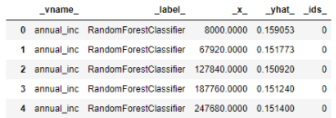

Below is the table's equivalent on a graph.


The x-axis gives us the range of values for the specified explanatory variable, while the y-axis tells us the average prediction (intercept) of the model. In this particular example, we can see that below values of 1 million, the average model prediction is set to go lower by around 0.004, before going up again to an average of 0.156.

```python
pd_profile(exp, var_type = 'categorical', variables = ['home_ownership', 'verification_status'])
```

We can obtain profiles for categorical variables by specifying the `variable_type` to be `categorical`, and calling categorical variables to the `.plot()` function.

The table created by calling the `.result` function showcases summarized results of all categories under each categorical variable:

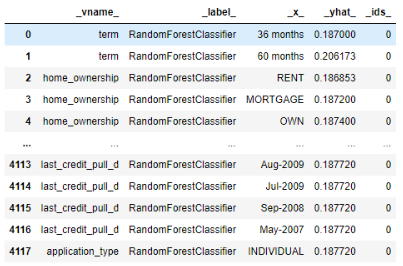

We see each categorical variable in the `_vname_` column, with specific categories under `_x_`. We are also given a `_yhat_` column which showcases the mean predictions of that variable-category combination in the model. The equivalent plot is shown below:

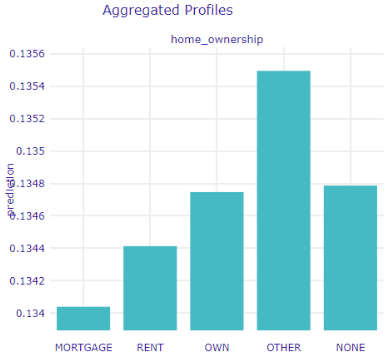

Notice that the graphs vary from the numerical model profiles, as we aren't looking at continuous variables anymore. Each bar represents a category within that explanatory variable, and showcases its difference for average predictions. Above, we can see that `MORTGAGE`-based home ownerships generally have less probability of default compared to those who `OWN`, have `NONE`, or have `OTHER` means of home ownerships. 

```python
# Grouped partial-dependence profiles
pd_profile(exp, groups = 'home_ownership', variables = ['annual_inc', 'int_rate'])
```

We can also split the output of the model into a group defined by the categories of an explanatory variable. We utilize the `groups` argument and specify a categorical variable, with which the the table and graphs add an additional label. In the image below, we can see that there are different `_label_` outputs, which specify the different categories within the group of `home_ownership`.

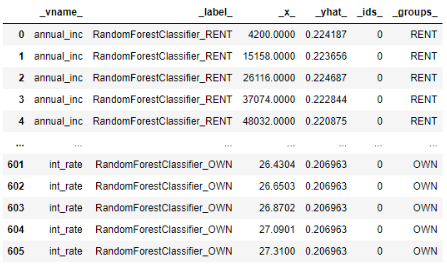

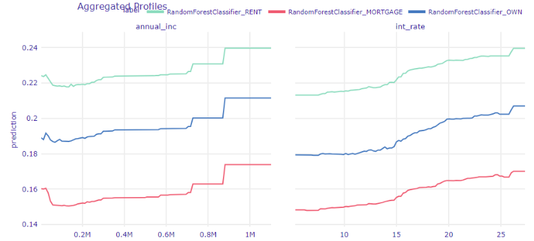

In the graph equivalent, we can see three lines in each graph, specifying the distribution of mean predictions across each numerical variable according to the categories of the grouped variable. 

*Warning*: This function is not flexible against many categories nor numerical variables in terms of layout, so expect some unfavorable graphs if you try some combinations.

## Variable-Importance Plot
How important is an explanatory variable? We can use them for:
- Model simplification: excluding variables that do not influence a model's predictions
- Model exploration: comparing variables' importance in different models may help in discovering interrelations between variables
- Domain-knowledge-based model validation: identification of most important variables may be helpful in assessing the validity of the model based on domain knowledge
- Knowledge generation: identification of important variables may lead to discovery of new factors involved in a particular mechanism

```python
# Variable-importance Measures
var_imp(exp, loss_function = 'mae')
```

If we remove certain explanatory variables from a model, by how much will the model performance change? This is what these sets of functions aim to showcase, by implementing a permutation-based approach to measuring the importance of an explanatory variable. By default, the function performs on 10 permutations calculated on a maximum of 1000 observations; this can be set manually.

The table below showcases a summary of the drop-out loss from each variable if they were removed from the model. In the example above, it displays that if the `total_rec_prncp` variable was removed from the model, the model would incur an additional drop-out loss of around +0.004.

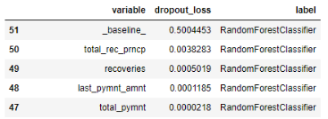

The equivalent graph showcases the variable importance in descending order. As seen in the table, we have `total_rec_prncp` as the most important variable, with `recoveries` and `last_pymnt_amnt` as slightly important as well. However, we can see that the rest of the variables has relatively little impact on the drop-out loss of the model. This seems to suggest that the RandomForestClassifier is quite reliant only on 3-4 main variables. This can be good or bad depending on the data availability and accuracy of the model. 

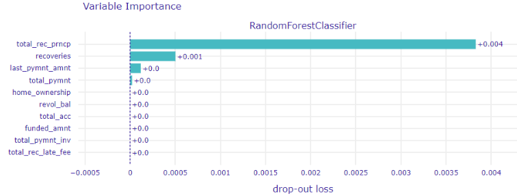

```python
# Grouped variable-importance measures
var_imp(exp, groups = {
    'total': ['total_acc', 'total_pymnt', 'total_pymnt_inv', 'total_rec_prncp',
    'total_rec_int', 'total_rec_late_fee', 'total_rev_hi_lim'],
    'amount': ['loan_amnt', 'funded_amnt', 'funded_amnt_inv', 'last_pymnt_amnt'],
    'categorical': X_train.select_dtypes(exclude = ['int64', 'float64']).columns.tolist()
}, loss_function = 'mae')
```

At times, variables are grouped together to see their contribution or influence to the model as a whole. This can be replicated by adding a dictionary to the `variable_groups` parameter. In the dictionary we specify the key as the name of the group, and the value as a list containing the names of the variable in this group. 

We can now output a shorter table with only the grouped variables considered and their respective drop-out losses. 

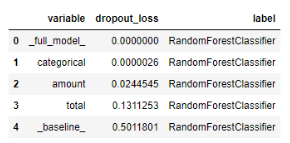

The equivalent graph will also only showcases these variables. As seen in the table, the drop-out loss for the grouped `categorical` variable is insignificant, thus barely shows in the graph.


*Warning:* Technically, an explanatory variable may be put into more than one group by the user. This will still output a table and graph, but will be misleading as the same variables shouldn't appear twice on the model. By default, the function does not also make another "group" composing of the remaining unnamed explanatory variables, so please be careful when extracting conclusions from this portion.

## Local-Dependence and Accumulated-Local Plots
While partial-dependence profiles are easy to explain, they may be misleading if certain explanatory variables are correlated, which is the case for many models. For example, one might expect in a *property valuation* dataset that the `floor_area` and `number_of_bedrooms` may be positively correlated, as usually larger houses would be able to take in more people. Thus, we present two explanation methods which mitigate this effect:
- **Local-dependence profiles**: On a model, the LD is defined as an expected value of predictions (or CP profiles) over a conditional distribution (the distribution of a certain explanatory variable). This conditional, or marginal, distribution is essentially some smaller part of the entire distribution, as if we had a regression tree dividing our distribution into defined parts.
- **Accumulated-local profiles**: This method averages the changes in the predictions, instead of the predictions themselves, and accumulates them over a grid. It does this by describing the local change of the model due to an explanatory variable, and averaging it over the explanatory variable's distribution. This ensures that the method is stable even with models containing highly correlated variables.

The visualization below showcases the differences between ceteris-paribus profiles (CP), partial-dependence profiles (PD), local-dependence profiles (LD), and accumulated-local profiles (AL).

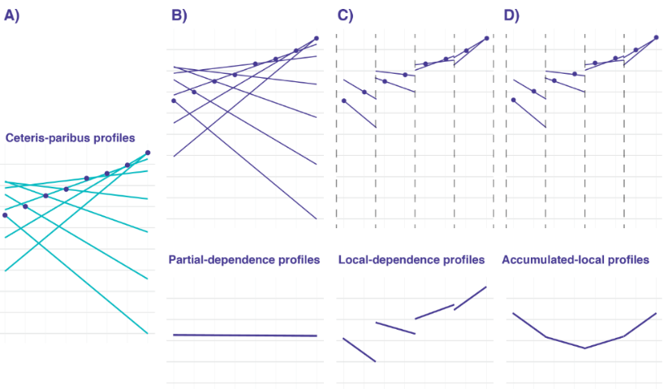

```python
# Local Dependence
ld_profile(exp, variables = ['annual_inc', 'int_rate'])
```


```python
# Accumulated Local
al_profile(exp, variables = ['annual_inc', 'int_rate'])
```


```python
# Compare profiles
compare_profiles(exp, variables = ['annual_inc', 'int_rate'])
```


To visualize the differences between the three proposed methods, we can plot all three in the same graph output. As shown below, we have two graphs describing the explanatory variables `annual_inc` and `int_rate` over three types of profiling methods. We see that the PD and AL profiles have slightly differing distributions, while the LD profile has a lower and decreasing distribution for `annual_inc`, and steadily increasing distribution for `int_rate`.


Note each of these three plots only suggest potential influence of explanatory variables to model output. It is a good practice to showcase these three plots together when trying to determine whether a certain explanatory variable indeed has a signficant influence. Case in point, if we only saw the LD profile of `int_rate`, we might have concluded that the variable has a positively correlating effect mean prediction. Only by comparing it with its PD and AL profiles can we see that this influence may be exaggerated. 

## Bar Plot
This takes the average of the SHAP value magnitudes across the dataset and plots it as a simple bar chart.

```python
shap_bar_glob(shap_values_glob, X_train_proc, feature_names = feature_names, class_ind = 0, class_names = class_names, reg = False)
```

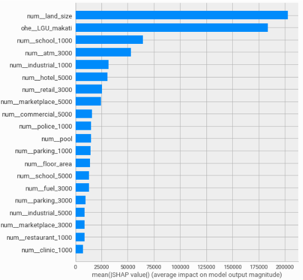

This also takes into account the preprocessed versions of your columns, hence the naming of the features.

## Summary Plot
Rather than use a typical feature importance bar chart, we use a density scatter plot of SHAP values for each feature to identify how much impact each feature has on the model output for individuals in the validation dataset. Features are sorted by the sum of the SHAP value magnitudes across all samples. It is interesting to note that the relationship feature has more total model impact than the captial gain feature, but for those samples where capital gain matters it has more impact than age. In other words, capital gain effects a few predictions by a large amount, while age effects all predictions by a smaller amount.

Note that when the scatter points don’t fit on a line they pile up to show density, and the color of each point represents the feature value of that individual.

```python
shap_summary(shap_values_glob, X_train_proc, feature_names = feature_names, class_ind = 0, class_names = class_names)
```

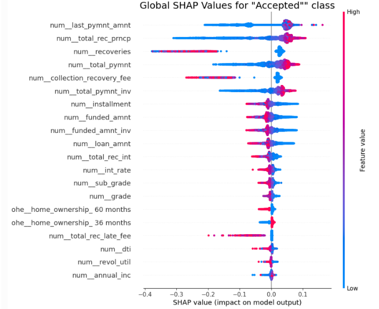

The color represents the feature value (<font color = 'red'>red for **high**</font>, <font color = 'blue'> blue for *low*</font>). In the example above, the plot reveals that low values of `num__last_pymnt_amnt` mostly have contribute to 0 or "Accepted" class. In `num_recoveries`, high values (or applicants with high amounts of recoveries) tend to have "Accepted" class as well, and some low values (applicants with low amounts of recoveries) have a slight positive contribution to the model (or may be in the "Rejected" class).

## Dependence Plot
We can also run a plot for SHAP interaction values to observe its main effects and interaction effects with other variables. We can look at it in two ways: 1) by comparing the original variable to its SHAP values, and 2) by directly looking at another variable. Note that we may have to specify the class of the target variable if we are working with a classification model, as seen below.

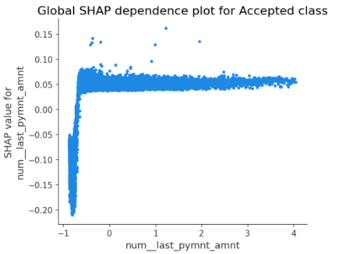

In this example above, we look at the dependence plot between `num__last_pymnt_amnt` and its SHAP values. We can see that the SHAP value mostly stays at around 0.05 for values [0, 4), except at ranges [-1, 0], where the SHAP value increases from -0.20 to 0.05.

```python
# Check feature names
print(feature_names)
```

```text
array(['cat__LGU_las pinas', 'cat__LGU_makati', 'cat__LGU_muntinlupa',
       'cat__LGU_paranaque', 'cat__LGU_pasig', 'cat__LGU_quezon',
       'cat__price_conditions_Negotiable',
       'cat__price_conditions_No Data', 'cat__income_class_1st',
       'cat__income_class_Special', 'num__capex_2021', 'num__yard',
       'num__college_5000', 'num__fast_food_5000', 'num__fast_food_1000',
       'num__library_books', 'num__atm_3000', 'num__restaurant_3000',
       'num__security.1', 'num__pub_1000', 'num__local_parking',
       'num__restaurant_1000', 'num__socex_2021', 'num__restaurant_5000',
       'num__fire_station_3000', 'num__poverty_inc', 'num__clinic_3000',
       'num__government_5000', 'num__infrastructure',
       'num__kindergarten_1000', 'num__resiliency',
       'num__industrial_3000', 'num__university_1000', 'num__hotel_5000',
       'num__garage', 'num__marketplace_3000', 'num__marketplace_5000',
       'num__industrial_5000', 'num__police_3000', 'num__productivity',
       'num__bank_1000', 'num__commercial_3000', 'num__sports_volleyball',
       'num__fuel_3000', 'num__growth_10years', 'num__warehouse',
       'num__local_airport', 'num__residential_3000',
       'num__kindergarten_5000', 'num__fuel_5000',
       'num__anreg_income_2021', 'num__supermarket_1000',
       'num__pharmacy_1000', 'num__subs_inc', 'num__land_size',
       'num__clinic_1000', 'num__atm_5000', 'num__fitness_center',
       'num__pop_2022', 'num__government_1000', 'num__pool',
       'num__cafe_1000', 'num__parking_3000', 'num__government_3000',
       'num__hospital_5000', 'num__pharmacy_3000', 'num__university_3000',
       'num__fast_food_3000', 'num__college_3000', 'num__retail_3000',
       'num__fire_station_5000', 'num__deck', 'num__kindergarten_3000',
       'num__police_5000', 'num__townhall_5000', 'num__bedrooms',
       'num__pharmacy_5000', 'num__school_1000', 'num__commercial_1000',
       'num__sports_tennis', 'num__university_5000',
       'num__commercial_5000', 'num__pub_3000', 'num__retail_5000',
       'num__hotel_3000', 'num__clinic_5000', 'num__residential_1000',
       'num__utilities', 'num__police_1000', 'num__parking_1000',
       'num__cafe_3000', 'num__college_1000', 'num__sports_basketball',
       'num__grass', 'num__school_3000', 'num__pub_5000',
       'num__residential_5000', 'num__townhall_3000', 'num__balcony',
       'num__supermarket_3000', 'num__fire_station_1000',
       'num__cafe_5000', 'num__bathrooms', 'num__hospital_1000',
       'num__smoke_free', 'num__floor_area', 'num__atm_1000',
       'num__hospital_3000', 'num__retail_1000', 'num__fireplace',
       'num__parking_5000', 'num__marketplace_1000', 'num__car_spaces',
       'num__ac_unit', 'num__security', 'num__bank_3000',
       'num__hotel_1000', 'num__industrial_1000', 'num__growth_5years',
       'num__fuel_1000', 'num__meeting_room', 'num__school_5000',
       'num__park', 'num__fence', 'num__townhall_1000',
       'num__supermarket_5000', 'num__bank_5000'], dtype=object)
```

If we add a specific interaction index (i.e. another column from the X dataset), we can get a slightly different graph:

```python
shap.initjs()
shap_dependence(shap_values_glob, X_train_proc, 'num__last_pymnt_amnt', feature_names = feature_names, class_ind = 0,
                    class_names = class_names, int_ind = 'num__recoveries')
```

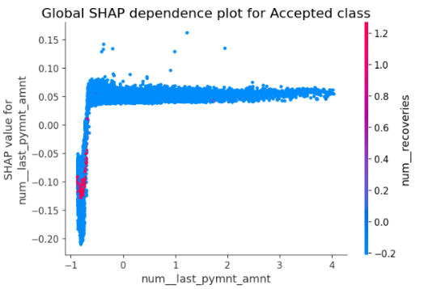

The difference in colors showcases the normalized ranges of `num_recoveries`. We can see that the high values of `num_recoveries` mostly come at the [-1, 0] range of `num__last_pymnt_amnt`, thus is not affected nor correlated significantly.

## Force Plot
Another way to visualize the same explanation is to use a force plot. If we take many local force plot explanations, rotate them 90 degrees, and then stack them horizontally, we can see explanations for an entire dataset.

Note that this graph is interactive.

```python
shap_force_glob(exp_glob, shap_values_glob, X_train_proc, feature_names = feature_names, class_ind = 0, class_names = class_names)
```
