# Stability
{: .no_toc }

## Table of contents
{: .no_toc .text-delta }

1. TOC
{:toc}

## Data Preparations

Import packages and data.

```python
# Call functions
import warnings
warnings.filterwarnings("ignore")

import pandas as pd
import numpy as np
import shap
shap.initjs()

# Display
from IPython.display import display
from sklearn.pipeline import Pipeline
from sklearn import set_config
set_config(display = 'diagram')


# Stability
from XRAIDashboard.stability.stability import get_feature_names, calculate_psi, psi_list, generate_psi_df, ks, mapping_columns, data_drift_dataset_report, data_drift_column_report, data_drift_dataset_test, data_drift_column_test, data_quality_dataset_report, data_quality_column_report, data_quality_dataset_test, data_quality_column_test, target_drift_report, regression_performance_report, regression_performance_test, classification_performance_report, classification_performance_test, cramer_von_mises, maximum_mean_discrepancy, fishers_exact_test, categs
from XRAIDashboard.stability.decile import print_labels, decile_table, model_selection_by_gain_chart, model_selection_by_lift_chart, model_selection_by_lift_decile_chart, model_selection_by_ks_statistic, decile_report
from evidently import ColumnMapping
```

Set up the data. 

```python
cur = train_data.copy()
ref = test_data.copy()

target_feature = target[0]

cur['prediction'] = model['DT'].predict(cur.drop(target, axis = 1))
ref['prediction'] = model['DT'].predict(ref.drop(target, axis = 1))

column_mapping = ColumnMapping()
column_mapping.target = 'loan_status'
column_mapping.id = 'id'
column_mapping.datetime_features = ['issue_d', 'last_pymnt_d', 'next_pymnt_d', 'last_credit_pull_d']

current_data, reference_data, column_mapping = mapping_columns(test_data,train_data, model['DT'], target_feature)
```

## Population Stability Index (PSI)
This compares the distribution of the target variable in the test dataset to a training data set that was used to develop the model.

```python
psi_list(X_train[cont], X_test[cont])
```

```text
Stability index for column id is 3.674617514443115e-05
There is no change or shift in the distributions of both datasets for column id.

Stability index for column member_id is 4.494571170411675e-06
There is no change or shift in the distributions of both datasets for column member_id.

Stability index for column loan_amnt is 1.9976159152606102e-05
There is no change or shift in the distributions of both datasets for column loan_amnt.

Stability index for column funded_amnt is 0.0
There is no change or shift in the distributions of both datasets for column funded_amnt.

Stability index for column funded_amnt_inv is 6.21125999927861e-06
There is no change or shift in the distributions of both datasets for column funded_amnt_inv.

Column term is a categorical column -- not valid for PSI.

Stability index for column int_rate is 1.356062067027262e-05
There is no change or shift in the distributions of both datasets for column int_rate.

Stability index for column installment is 3.399860559210091e-05
There is no change or shift in the distributions of both datasets for column installment.

Stability index for column grade is 5.357805398563391e-05
There is no change or shift in the distributions of both datasets for column grade.

Stability index for column sub_grade is 6.78031033513631e-06
There is no change or shift in the distributions of both datasets for column sub_grade.

Stability index for column emp_length is 0.0003295981698523793
There is no change or shift in the distributions of both datasets for column emp_length.

Column home_ownership is a categorical column -- not valid for PSI.

Stability index for column annual_inc is 0.0006437751649736402
There is no change or shift in the distributions of both datasets for column annual_inc.

Column verification_status is a categorical column -- not valid for PSI.

Column issue_d is a categorical column -- not valid for PSI.

Column pymnt_plan is a categorical column -- not valid for PSI.

Column purpose is a categorical column -- not valid for PSI.

Column title is a categorical column -- not valid for PSI.

Column zip_code is a categorical column -- not valid for PSI.

Column addr_state is a categorical column -- not valid for PSI.

Stability index for column dti is 0.0009761837234856511
There is no change or shift in the distributions of both datasets for column dti.

Stability index for column delinq_2yrs is 0.0
There is no change or shift in the distributions of both datasets for column delinq_2yrs.

Stability index for column earliest_cr_line is 0.0017365539398582043
There is no change or shift in the distributions of both datasets for column earliest_cr_line.

Stability index for column inq_last_6mths is 0.0
There is no change or shift in the distributions of both datasets for column inq_last_6mths.

Stability index for column open_acc is 6.931471805599453e-05
There is no change or shift in the distributions of both datasets for column open_acc.

Stability index for column pub_rec is 0.0
There is no change or shift in the distributions of both datasets for column pub_rec.

Stability index for column revol_bal is 0.0006437751649736402
There is no change or shift in the distributions of both datasets for column revol_bal.

Stability index for column revol_util is 0.0003756821961098413
There is no change or shift in the distributions of both datasets for column revol_util.

Stability index for column total_acc is 2.2314355131420965e-05
There is no change or shift in the distributions of both datasets for column total_acc.

Column initial_list_status is a categorical column -- not valid for PSI.

Stability index for column out_prncp is 0.0006437751649736402
There is no change or shift in the distributions of both datasets for column out_prncp.

Stability index for column out_prncp_inv is 0.0006437751649736402
There is no change or shift in the distributions of both datasets for column out_prncp_inv.

Stability index for column total_pymnt is 7.870927934024724e-05
There is no change or shift in the distributions of both datasets for column total_pymnt.

Stability index for column total_pymnt_inv is 1.9062035960864997e-05
There is no change or shift in the distributions of both datasets for column total_pymnt_inv.

Stability index for column total_rec_prncp is 5.031512882743999e-06
There is no change or shift in the distributions of both datasets for column total_rec_prncp.

Stability index for column total_rec_int is 0.0014539314239805515
There is no change or shift in the distributions of both datasets for column total_rec_int.

Stability index for column total_rec_late_fee is 0.0
There is no change or shift in the distributions of both datasets for column total_rec_late_fee.

Stability index for column recoveries is 0.0
There is no change or shift in the distributions of both datasets for column recoveries.

Stability index for column collection_recovery_fee is 0.0
There is no change or shift in the distributions of both datasets for column collection_recovery_fee.

Column last_pymnt_d is a categorical column -- not valid for PSI.

Stability index for column last_pymnt_amnt is 0.00015415067982725835
There is no change or shift in the distributions of both datasets for column last_pymnt_amnt.

Column next_pymnt_d is a categorical column -- not valid for PSI.

Column last_credit_pull_d is a categorical column -- not valid for PSI.

Stability index for column collections_12_mths_ex_med is 0.0
There is no change or shift in the distributions of both datasets for column collections_12_mths_ex_med.

Stability index for column policy_code is 0.0
There is no change or shift in the distributions of both datasets for column policy_code.

Column application_type is a categorical column -- not valid for PSI.

Stability index for column acc_now_delinq is 0.0
There is no change or shift in the distributions of both datasets for column acc_now_delinq.

Stability index for column tot_coll_amt is 0.0
There is no change or shift in the distributions of both datasets for column tot_coll_amt.

Stability index for column tot_cur_bal is 0.0002197224577336219
There is no change or shift in the distributions of both datasets for column tot_cur_bal.

Stability index for column total_rev_hi_lim is 0.0
There is no change or shift in the distributions of both datasets for column total_rev_hi_lim.
```

## Kolmogorov-Smirnov (K-S) Test
The K-S test is a nonparametric test that compares the cumulative distributions of two data sets, in this case, the training data and the post-training data. The null hypothesis for this test states that the data distributions from both the datasets are same. If the null is rejected then we can conclude that there is a drift in the data.

```python
ks_df, a = ks(pd.DataFrame(
    preprocessor.transform(X_train), columns = preprocessor.get_feature_names_out()), pd.DataFrame(preprocessor.transform(X_test), columns = preprocessor.get_feature_names_out()))
ks_df
```

```text
<filler here>
```

## Data Drift
You can detect and analyze changes in the input feature distributions.
1. To monitor the model performance without ground truth. When you do not have true labels or actuals, you can monitor the feature drift to check if the model operates in a familiar environment. You can combine it with the Prediction Drift. If you detect drift, you can trigger labeling and retraining, or decide to pause and switch to a different decision method.
2. When you are debugging the model quality decay. If you observe a drop in the model quality, you can evaluate Data Drift to explore the change in the feature patterns, e.g., to understand the change in the environment or discover the appearance of a new segment.
3. To understand model drift in an offline environment. You can explore the historical data drift to understand past changes in the input data and define the optimal drift detection approach and retraining strategy.
4. To decide on the model retraining. Before feeding fresh data into the model, you might want to verify whether it even makes sense. If there is no data drift, the environment is stable, and retraining might not be necessary.

```python
data_drift_report, ddf = data_drift_dataset_report(current_data, reference_data,column_mapping = column_mapping)
data_drift_report.save_html(f'assets/reports/data_drift_report.html')
```

This evaluates the data drift in each individual column of the current dataset, and determines if the dataset has definite data drift.
    
Drift detection methods that can be used for `stattest` and other equivalent parameters are as follows:
- `ks`: Kolmogorov-Smirnov test, only numerical. Returns p_value drift detected when less than threshold (default is 0.05).
- `chisquare`: Chi-Square test, only categorical. Returns p_value drift detected when less than threshold (default is 0.05).
- `z`: Z-test, only categorical. Returns p_value drift detected when less than threshold (default is 0.05).
- `wasserstein`: Normalized Wasserstein distance, only numerical. Returns distance drift detected when greater than or equal to threshold (default is 0.1).
- `kl_div`: Kullback-Leibler, numerical and categorical. Returns divergence drift detected when greater than or equal to threshold (default is 0.1).
- `psi`: Population Stability Index, numerical and categorical. Returns psi_value drift detected when greater than or equal to threshold (default is 0.1).
- `jensenshannon`: Jensen-Shannon distance, numerical and categorical. Default method for categorical, if there are > 1000 objects. Returns distance drift detected when greater than or equal to threshold (default is 0.1).
- `anderson`: Anderson-Darling test, only numerical. Returns p_value drift detected when less than threshold (default is 0.05).
- `fisher_exact`: Fisher's Exact test, only categorical. Returns p_value drift detected when less than threshold (default is 0.05).
- `cramer_von_mises`: Cramer-Von-Mises test, only numerical. Returns p_value drift detected when less than threshold (default is 0.05).
- `g-test`: G-test, only categorical. Returns p_value drift detected when less than threshold (default is 0.05).
- `hellinger`: Normalized Hellinger distance, numerical and categorical. Returns distance drift detected when greater than or equal to threshold (default is 0.1).
- `mannw`: Mann-Whitney U-rank test, only numerical. Returns p_value drift detected when less than threshold (default is 0.05).
- `ed`: Energy distance, only numerical. Returns distance drift detected when greater than or equal to threshold (default is 0.1).
- `es`: Epps-Singleton test, only numerical. Returns p_value drift detected when less than threshold (default is 0.05).
- `t_test`: T-Test, only numerical. Returns p_value drift detected when less than threshold (default is 0.05).
- `emperical_mmd`: Emperical-MMD, only numerical. Returns p_value drift detected when less than threshold (default is 0.05).
- `TVD`: Total-Variation-Distance, only categorical. Returns p_value drift detected when less than threshold (default is 0.05).
A combination of these tests are used if `stattest` and other equivalent parameters are not explicitly specified. Accessing the HTML file gives you this view:


You can also specify a single column and check it for data drift:

```python
col = 'loan_amnt'
data_drift_report_col, ddf = data_drift_column_report(current_data,reference_data,col)
data_drift_report_col.save_html(f'assets/reports/data_drift_report_col.html')
```

Opening this will give you this view:


We also have separate functions for verifying data drift in deployed models or OOT data.

```python
data_drift_test, ddt = data_drift_dataset_test(current_data,reference_data,column_mapping=column_mapping)
data_drift_test.save_html(f'assets/reports/data_drift_test.html')
```

This compares the distribution of each column in the current dataset to the reference and tests the number and share of drifting features against a defined condition.

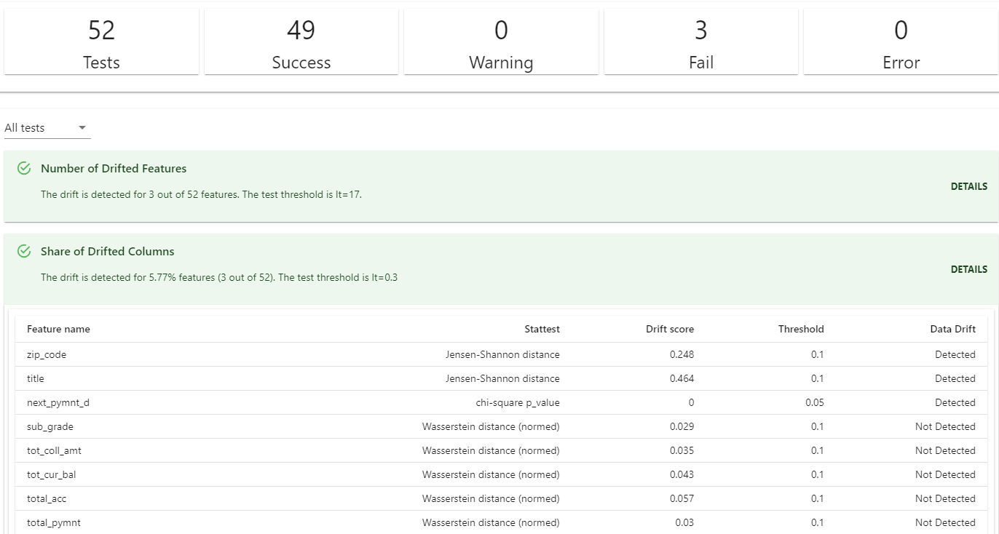

You can also specify a single column and check it for data drift:

```python
data_drift_test_col, ddt = data_drift_column_test(current_data,reference_data,col)
data_drift_test_col.save_html(f'assets/reports/data_drift_test_col.html')
```

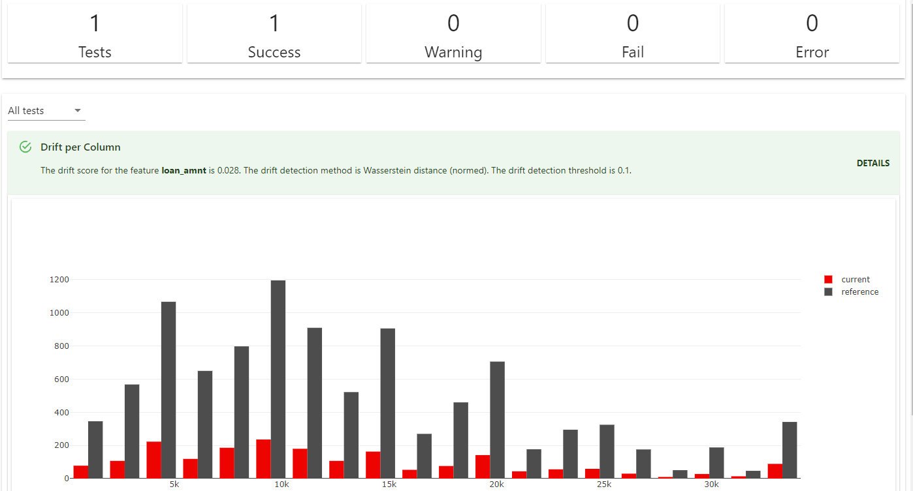

## Data Quality
With our toolkit, you can explore and track various dataset and feature statistics.
1. Data quality tests in production. You can check the quality and stability of the input data before you generate the predictions, every time you perform a certain transformation, add a new data source, etc.
2. Data profiling in production. You can log and store JSON snapshots of your production data stats for future analysis and visualization.
3. Exploratory data analysis. You can use the visual report to explore your training dataset and understand which features are stable and useful enough to use in modeling.
4. Dataset comparison. You can use the report to compare two datasets to confirm similarities or understand the differences. For example, you might compare training and test dataset, subgroups in the same dataset (e.g., customers from Region 1 and Region 2), or current production data against training.
5. Production model debugging. If your model is underperforming, you can use this report to explore and interpret the details of changes in the input data or debug the quality issues.

```python
data_quality_report, dqr = data_quality_dataset_report(current_data,reference_data,column_mapping=column_mapping)
data_quality_report.save_html(f'assets/reports/data_quality_report.html')
```

With this report under data quality, our function:
- Calculates various descriptive statistics,
- Calculates number and share of missing values
- Plots distribution histogram,
- Calculates quantile value and plots distribution,
- Calculates correlation between defined column and all other columns
- If categorical, calculates number of values in list / out of the list / not found in defined column
- If numerical, calculates number and share of values in specified range / out of range in defined column, and plots distributions

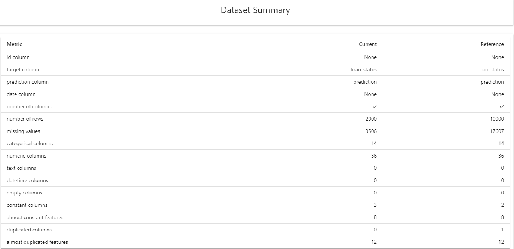

This can also be done for a single column.

```python
data_quality_report_col, _ = data_quality_column_report(current_data,reference_data,col)
data_quality_report_col.save_html(f'assets/data_quality_report_col.html')
```

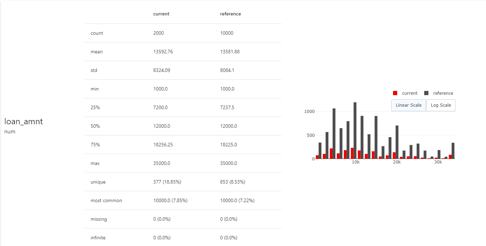

We also have separate functions for verifying data quality in deployed models or OOT data. For all columns in a dataset, the `data_quality_dataset_test` function:
- Tests number of rows and columns against reference or defined condition
- Tests number and share of missing values in the dataset against reference or defined condition
- Tests number and share of columns and rows with missing values against reference or defined condition
- Tests number of differently encoded missing values in the dataset against reference or defined condition
- Tests number of columns with all constant values against reference or defined condition
- Tests number of empty rows (expects 10% or none) and columns (expects none) against reference or defined condition
- Tests number of duplicated rows (expects 10% or none) and columns (expects none) against reference or defined condition
- Tests types of all columns against the reference, expecting types to match

```python
data_quality_test, dqt = data_quality_dataset_test(current_data,reference_data,column_mapping=column_mapping)
data_quality_test.save_html(f'assets/reports/data_quality_test.html')
```

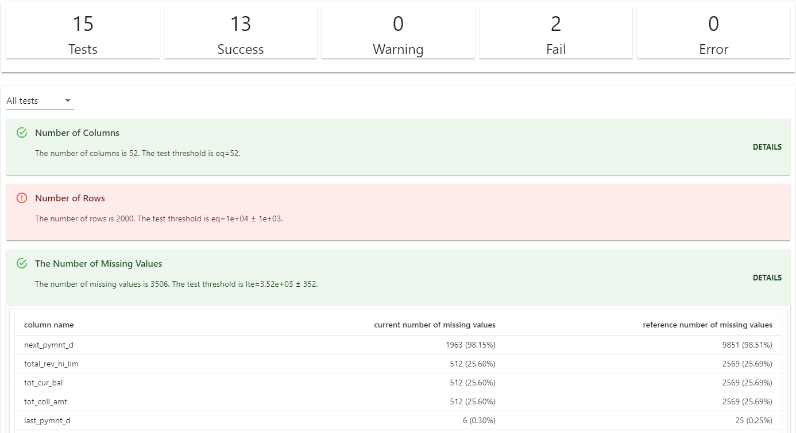

This can also be done for a single column.

```python
data_quality_test_col, dqt = data_quality_column_test(current_data,reference_data,col)
```

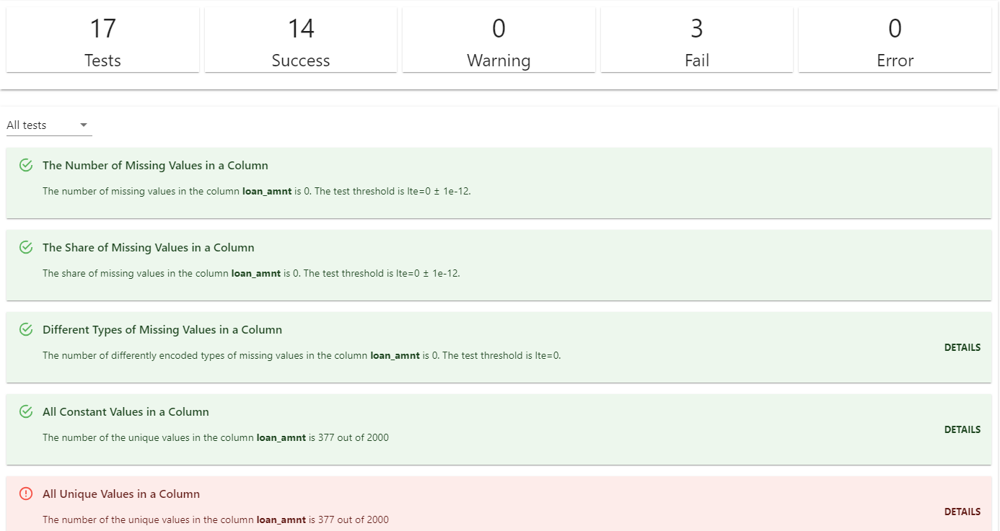

## Classification Report and Tests
We also have functions that can compare the performance of classification models. For a classification model, the report generated from `classification_performance_report` shows the following:
- Calculates various classification performance metrics, such as precision, accuracy, recall, F1-score, TPR, TNR, FPR, FNR, AUROC, LogLoss
- Calculates the number of objects for each label and plots a histogram
- Calculates the TPR, TNR, FPR, FNR, and plots the confusion matrix
- Calculates the classification quality metrics for each class and plots a matrix
- For probabilistic classification, visualizes the predicted probabilities by class
- For probabilistic classification, visualizes the probability distribution by class
- For probabilistic classification, plots the ROC Curve
- For probabilistic classification, plots the Precision-Recall curve
- Calculates the Precision-Recall table that shows model quality at a different decision threshold
- Visualizes the relationship between feature values and model quality

```python
classification_report, cpr = classification_performance_report(current_data,reference_data,column_mapping=column_mapping)
classification_report.save_html(f'assets/reports/classification_report.html')
```

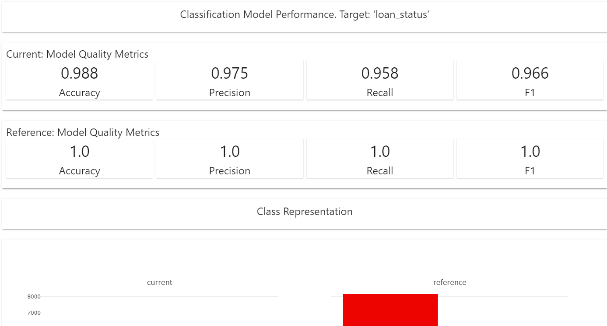

The `classification_performance_test` function computes the following tests on classification data, failing if +/- a percentage (%) of scores over reference data is achieved:
- Accuracy, Precision, Recall, F1 on the whole dataset
- Precision, Recall, F1 on each class
- Computes the True Positive Rate (TPR), True Negative Rate (TNR), False Positive Rate (FPR), False Negative Rate (FNR)
- For probabilistic classification, computes the ROC AUC and LogLoss

```python
approx_val = {
    'mae': 30,
    'rmse': 4.5,
    'me': 15,
    'mape': 0.2,
    'ame': 50,
    'r2': 0.75
}
classification_test, cpt = classification_performance_test(current_data,reference_data,column_mapping=column_mapping, approx_val = None)
classification_test.save_html(f'assets/reports/classification_test.html')
```

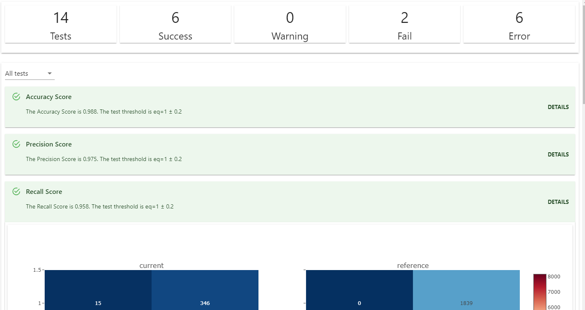

## Regression Report and Tests
We have similar functions for regression models. For a regression model, the report generated from `regression_performance_report` shows the following:
- Calculates various regression performance metrics, including Mean Error, MAPE, MAE, etc.
- Visualizes predicted vs. actual values in a scatter plot and line plot
- Visualizes the model error (predicted - actual) and absolute percentage error in respective line plots
- Visualizes the model error distribution in a histogram
- Visualizes the quantile-quantile (Q-Q) plot to estimate value normality
- Calculates and visualizes the regression performance metrics for different groups -- top-X% with overestimation, top-X% with underestimation
- Plots relationship between feature values and model quality per group (for top-X% error groups)
- Calculates the number of instances where model returns a different output for an identical input
- Calculates the number of instances where there is a different target value/label for an identical input

```python
regression_report, rpr = regression_performance_report(current_data,reference_data,column_mapping=column_mapping)
regression_report.save_html(f'assets/reports/regression_report.html')
```

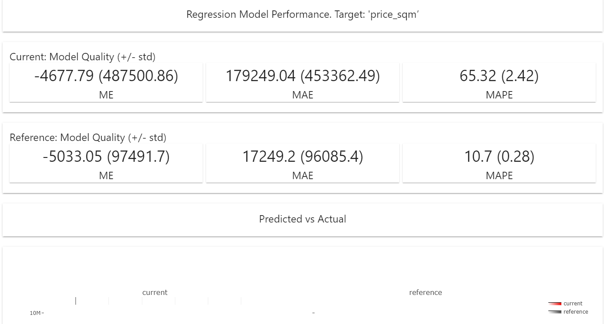

The `classification_performance_test` function computes the following tests on regression data, failing if +/- a percentage (%) of scores over reference data is achieved:
- Mean Absolute Error (MAE)
- Root Mean Squared Error (RMSE)
- Mean Error (ME) and tests if it is near zero
- Mean Absolute Percentage Error (MAPE)
- Absolute Maximum Error
- R2 Score (coefficient of determination)

```python
approx_val = {
    'mae': 30,
    'rmse': 4.5,
    'me': 15,
    'mape': 0.2,
    'ame': 50,
    'r2': 0.75
}
regression_test, rpt = regression_performance_test(current_data,reference_data,column_mapping=column_mapping, approx_val = approx_val)
regression_test.save_html(f'assets/reports/regression_test.html')
```


## Target Drift
You can detect and explore changes in the target function (prediction) and detect distribution drift.
1. To monitor the model performance without ground truth. When you do not have true labels or actuals, you can monitor Prediction Drift to react to meaningful changes. For example, to detect when there is a distribution shift in predicted values, probabilities, or classes. You can often combine it with the Data Drift analysis.
2. When you are debugging the model decay. If you observe a drop in performance, you can evaluate Target Drift to see how the behavior of the target changed and explore the shift in the relationship between the features and prediction (target).
3. Before model retraining. Before feeding fresh data into the model, you might want to verify whether it even makes sense. If there is no target drift and no data drift, the retraining might not be necessary.

```python
target_drift_report, tdr = target_drift_report(current_data,reference_data,column_mapping=column_mapping)
target_drift_report.save_html(f'assets/reports/target_drift_report.html')
```

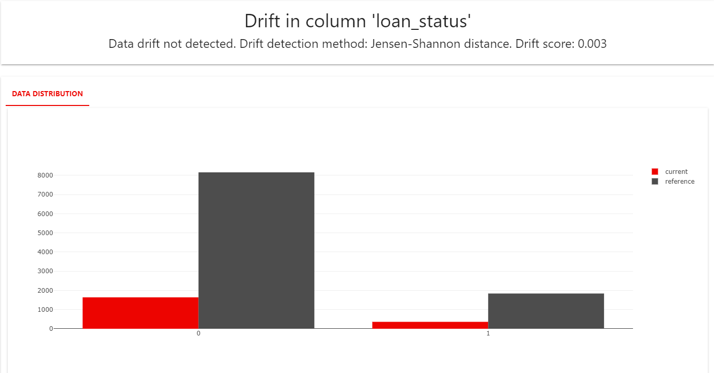

This can also be done for regression models.

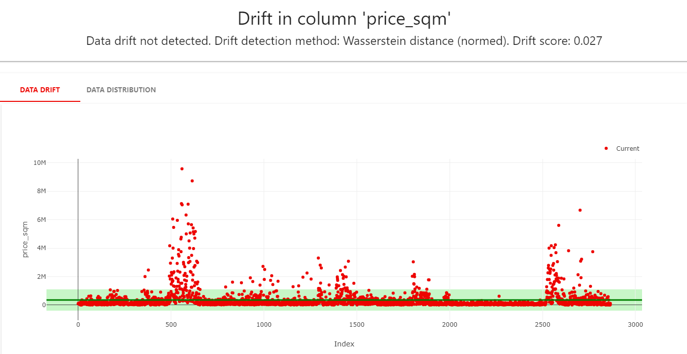

## Cramer-von-Mises
Cramer-von Mises (CVM) data drift detector, which tests for any change in the distribution of continuous univariate data. This works for both regression and classification use cases. For multivariate data, a separate CVM test is applied to each feature, and the obtained p-values are aggregated via the Bonferroni or False Discovery Rate (FDR) corrections.

For this, let's simulated drifted data by artificially adding data to `X_test`. We can also apply covariate drift by altering some data, or apply concept drift by switching the ground truths.

```python
# Shift data by adding artificially adding drift to X_test
X_covar, y_covar = X_test2.copy(), y_test2.copy()
X_concept, y_concept = X_test2.copy(), y_test2.copy()

# Apply covariate drift by altering some data in x (manual altering)
idx1 = y_test2[y_test2 == 1].index
X_covar.loc[idx1, 'last_pymnt_amnt'] += 10000

# Apply concept drift by switching two species
idx2 = y_test2[y_test2 == 0].index
y_concept[idx1] = 0
y_concept[idx2] = 1

Xs = {'No drift': preprocessor.transform(X_test2), 'Covariate drift': preprocessor.transform(X_covar), 'Concept drift': preprocessor.transform(X_concept)}
# Xs

print('Reference data:', model['DT'].score(X_ref2, y_ref2))
print('Reference data:', model['DT'].score(X_test2, y_test2))
print('Reference data:', model['DT'].score(X_covar, y_covar))
print('Reference data:', model['DT'].score(X_concept, y_concept))
```

```text
Reference data: 0.9915933681015023
Reference data: 0.9922783529228614
Reference data: 0.9639760255312524
Reference data: 0.007721647077138631
```

As we have now generated some sample data, we can compute for model indicators for supervised drift detection.

```python
# Supervised drift detection, compute for model indicators
loss_ref = (model['DT'].predict(X_ref2) == y_ref2).astype(int)
loss_test = (model['DT'].predict(X_test2) == y_test2).astype(int)
loss_covar = (model['DT'].predict(X_covar) == y_covar).astype(int)
loss_concept = (model['DT'].predict(X_concept) == y_concept).astype(int)
losses = {'No drift': loss_test, 'Covariate drift': loss_covar, 'Concept drift': loss_concept}

print(loss_ref)

cramer_von_mises(loss_ref, losses)
```

```text
99674     1
151871    1
14255     1
110903    1
98012     1
         ..
385278    1
375430    1
35255     1
232878    1
14290     1
Name: loan_status, Length: 64235, dtype: int64

No drift
Drift? No!
p-value: 0.9999998807907104

Covariate drift
Drift? Yes!
p-value: 1.5830801114447013e-09

Concept drift
Drift? Yes!
p-value: 1.1667882517940598e-06
```

## Fisher's Exact Test
Fisher's Exact Test (FET) is a data drift detector which tests for a change in the mean of binary univariate data. This works for classification use cases only. For multivariate data, a separate FET test is applied to each feature, and the obtained p-values are aggregated via the Bonferroni or False Discovery Rate (FDR) corrections.

```python
fishers_exact_test(loss_ref, losses)
```

```text
No drift
Drift? No!
p-value: 0.9198199121187643

Covariate drift
Drift? Yes!
p-value: 1.1295207438754438e-265

Concept drift
Drift? Yes!
p-value: 0.0
```

## Decile Analysis
A decile table divides data into ten equal parts, each representing 10% of the total observations. It organizes the data in ascending order, allowing for a clear view of its distribution. Decile analysis involves studying these segments to understand characteristics or patterns within different sections of the data, aiding in comparisons, trend identification, and insights into various metrics such as income distribution, performance rankings, or other segmented data analyses. This method is valuable for comprehending variations and nuances within a dataset by breaking it down into equal-sized portions for analysis.

```python
predict_train = pd.Series(model['DT'].predict_proba(X_train)[:, 1], index = train_data.index)
predict_test = pd.Series(model['DT'].predict_proba(X_test)[:, 1], index = test_data.index)

train_data['prob'] = predict_train
test_data['prob'] = predict_test

dc, ks = decile_table(train_data['loan_status'], train_data['prob'])
dc
```

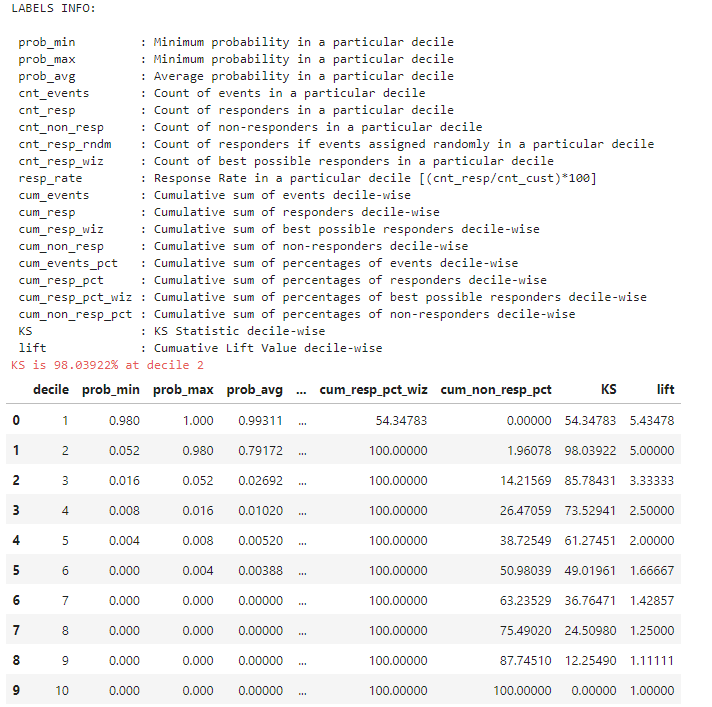

Other than the decile table, we can generate charts to help verify the true the KS statistic.
- Gain Chart
- Lift Chart
- Lift Decile Chart
- KS Statistic: Graphical representation of the decile table

```python
fig1 = model_selection_by_gain_chart({'DT': dc})
fig2 = model_selection_by_lift_chart({'DT': dc})
fig3 = model_selection_by_lift_decile_chart({'DT': dc})
fig4 = model_selection_by_ks_statistic({'DT': dc})

fig1, fig2, fig3, fig4
```


